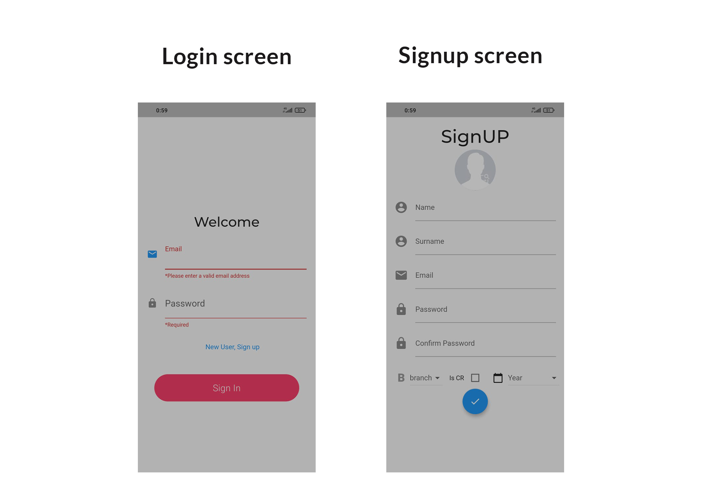
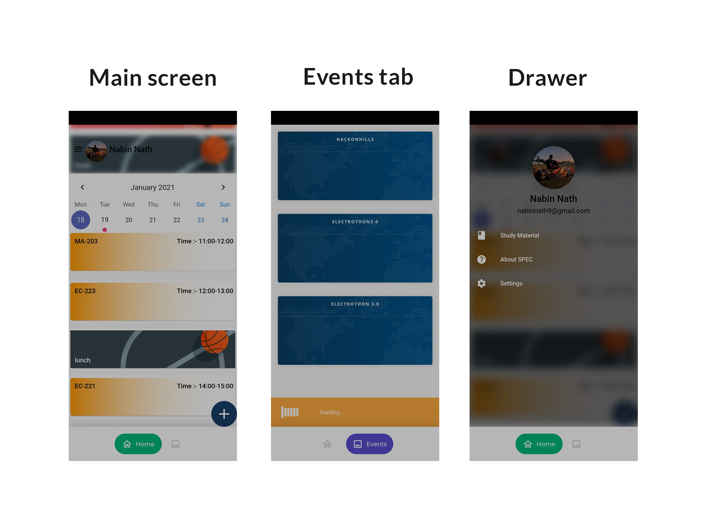
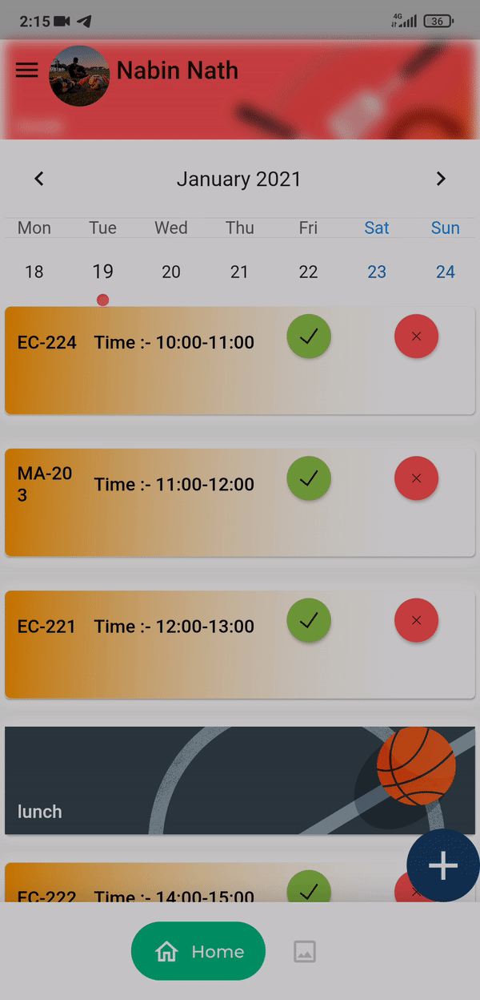
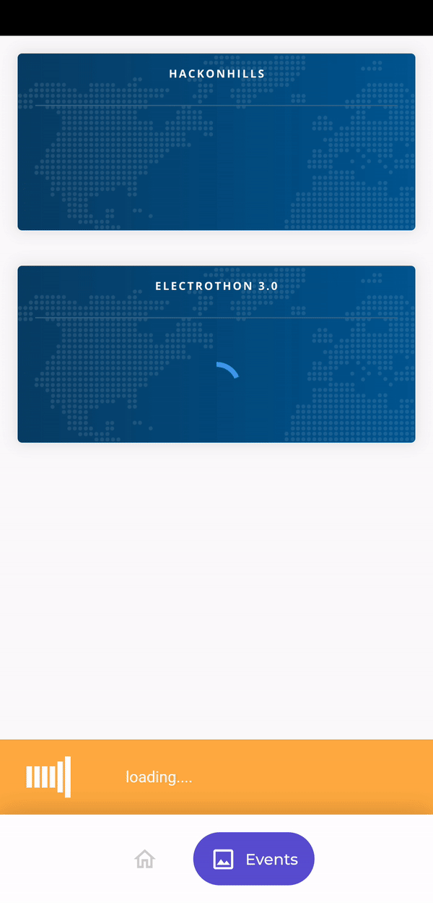

# spec_app

<!-- PROJECT LOGO -->
 

  

  <h3 align="center">SPEC-MOBILE-APPLICATION</h3>
    

    A flutter app for students of National Institute of Technology Hamirpur
  

  <!-- TABLE OF CONTENTS -->
  

    
Table of Contents

    <ol>
      <li>
        <a href="#about-the-project">About The Project</a>
        <ul>
          <li><a href="#built-with">Built With</a></li>
        </ul>
      </li>
      <li><a href="#progress">Progress</a></li>
      <li><a href="#upcomming-features">Upcomming Features</a></li>
      <li><a href="#contributing">Contributing</a></li>
    </ol>
  

  <!-- ABOUT THE PROJECT -->
  ## About The Project
  
  
  
  
  

* A mobile application that serves multiple purposes to the user by creating a personalized interface for every individual by letting them create their own profiles ( signup using the Google APIs ) alerts of deadlines of submissions, also we can add free resources of different Technology which we have used ourselves to help students developing different skills and extra classes will be made available since the students will be able to set up their own personal timetable with the same.  

* Updates of events happening in the college like Electrothon 2.0 ,  workshops, events, and interviews of various clubs and societies, etc. Brochures regarding the same can also be circulated on the app itself.

* As Team SPEC organises different Workshops and Events throughout the year so we can add a feature of Student Registration in the App for each workshop and event and maintain all the data on our database. Also resources used to teach in the workshop can be made available on the App and can take feedback of the workshop too in it. 
We can add contact details of All the Faculty members of ECE Department in the App. So, whenever any student needs the help of any faculty member can get his/her details directly in the App. 

* A live chat feature will let the students talk to the mentors at some specified time as per the schedule. 
Last but not the least, subjective resources like pdfs of notes, books, past year papers, and links to important video lectures will also be provided.

  Goals:
  * Providing students with better access to all the available resources
  * Makes it easier for students to get the right resources to develop different skills of their choice, get help on these from members of Team SPEC, get study material like previous year Notes, Question Papers and pdf of books compiled at one place.
  * Showing all college related updates like Electrothon, Spec-Fest or maybe the day's timetable.

### Built With

  A few resources to get you started if this is your first Flutter project:

- [Lab: Write your first Flutter app](https://flutter.dev/docs/get-started/codelab)
- [Cookbook: Useful Flutter samples](https://flutter.dev/docs/cookbook)

For help getting started with Flutter, view our
[online documentation](https://flutter.dev/docs), which offers tutorials,
samples, guidance on mobile development, and a full API reference.

  <!-- Progress -->
  ## Progress

  * User login 
  * Signup page
  * A personalized UI for every student. 
  * Successfully added the timetable of the ECE department giving the details of teachers and classes with the feasibility of the student 
  * Event manager with firebase,  which keeps the student updated regarding the upcoming events

  <!-- Upcomming Features -->
  ## Upcomming Features

  * Merge the event updates with the timetable
  * Live Chat/ mentor chat
  * Sunil sir k notes pdf
  * Video player in the app itself for the video lectures of our professors
  * Notification alert for next class
  * CR privileges(class cancel, extra class, any other cr related updates)

  <!-- CONTRIBUTING -->
  ## Contributing

  **Feel free to raise an issue or contribute in this project**.

  1. Fork the Project
  2. Create your Feature Branch (`git checkout -b feature/AmazingFeature`)
  3. Commit your Changes (`git commit -m 'Add some AmazingFeature'`)
  4. Push to the Branch (`git push origin feature/AmazingFeature`)
  5. Open a Pull Request

